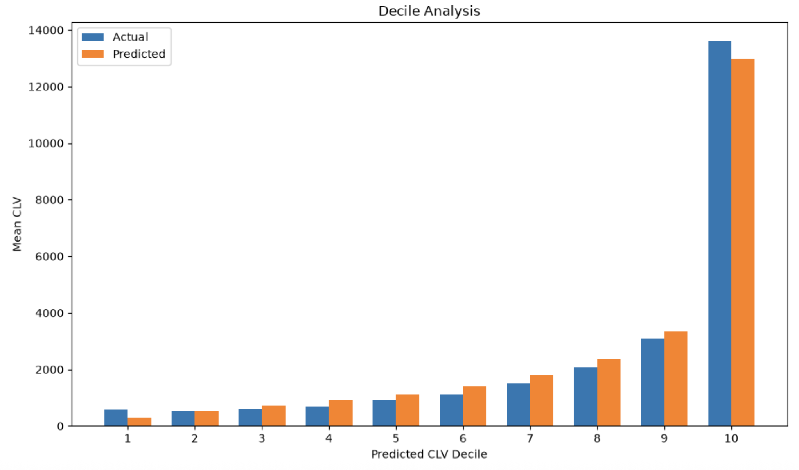

# Customer Behavior Prediction Case Study

This project builds an end-to-end customer analytics workflow for a UK online
retailer. Starting from raw transaction lines, it prepares calibration and
holdout datasets, cleans noisy retail data, predicts future purchase frequency,
estimates customer lifetime value, and evaluates several product recommendation
strategies.

The business goal is to answer three practical questions:

1. Which customers are likely to remain active, and which customers are likely
   to churn?
2. What is each customer's expected customer lifetime value (CLV)?
3. Which products should be recommended to each customer in the future period?

The analysis uses the UCI Online Retail II dataset, which contains transaction
history from a UK-based online retailer.

## Results

| Task | Holdout result |
| --- | --- |
| Zero-purchase prediction | ROC AUC: **0.748** |
| Aggregate CLV | Predicted **6.86M** vs actual **6.67M** (**+2.94%**) |
| Customer-level CLV | Pearson correlation: **0.913**; WAPE: **51.34%** |
| All-product recommendation | Precision@10: **0.394**; NDCG@10: **0.436** |
| New product recommendation | Precision@10: **0.112**; NDCG@10: **0.120** |
| New-catalogue recommendation | Precision@10: **0.126**; NDCG@10: **0.139** |

The CLV estimates are most useful for ranking and segmenting customers rather than forecasting each customer's exact spend. The recommendation rankers outperform global popularity, including on the more difficult new-product tasks.


## Project Structure

| Notebook | Purpose |
| --- | --- |
| `00_Create_case_study_data.ipynb` | Downloads the raw Online Retail II data, creates a time-based calibration/holdout split, and builds product catalog files. |
| `01_Cleaning.ipynb` | Cleans calibration and holdout transactions, handles returns/cancellations, removes non-product activity, and creates order-level datasets. |
| `02_Purchase_Frequency.ipynb` | Fits a Pareto/NBD model to predict future purchase counts and customer activity. |
| `03_CLV.ipynb` | Fits a Gamma-Gamma monetary-value model and combines it with purchase-frequency predictions to estimate CLV. |
| `04_Product_reco.ipynb` | Builds and evaluates product recommendation models, including popularity, repeat purchase, market-basket, semantic, two-tower, and LightGBM ranking approaches. |

## Data Flow

The notebooks should be run in order:

```text
00_Create_case_study_data.ipynb
        |
        v
01_Cleaning.ipynb
        |
        +--> 02_Purchase_Frequency.ipynb
        |           |
        |           v
        |      03_CLV.ipynb
        |
        v
04_Product_reco.ipynb
```

## Input Data

The project uses the UCI Online Retail II dataset. The raw file contains
1,067,371 transaction lines with the following fields:

- `Invoice`
- `StockCode`
- `Description`
- `Quantity`
- `InvoiceDate`
- `Price`
- `Customer ID`
- `Country`

The transaction history is split using 5 December 2010 as the cutoff:

- Transactions on or before 5 December 2010 form the calibration period.
- Transactions after 5 December 2010 form the holdout period.

The calibration period is used for cleaning and model fitting. The holdout
period is kept as unseen future data for evaluation.

## Generated Files

The workflow creates the following main files:

| File | Description |
| --- | --- |
| `data/given_data/calibration_raw.csv` | Raw calibration-period transaction lines. |
| `data/given_data/holdout_transaction.csv` | Future-period transaction lines used for holdout evaluation. |
| `data/given_data/prod_catalog_calib.csv` | Product catalog observed during the calibration period. |
| `data/given_data/prod_catalog_holdout.csv` | Product catalog observed during the holdout period. |
| `data/working_data/calib_all_transaction.csv` | Cleaned calibration transaction-level data for recommendation modeling. |
| `data/working_data/calib_order.csv` | Cleaned calibration customer-order-level data. |
| `data/working_data/holdout_order.csv` | Cleaned holdout customer-order-level data. |
| `data/working_data/lifetimes.csv` | Customer-level RFM and Pareto/NBD outputs used for CLV modeling. |

## Cleaning Approach

The cleaning notebook prepares the raw retail data for modeling by:

- Standardizing identifiers, dates, customer IDs, product descriptions, and text
  fields.
- Matching negative-quantity rows to earlier positive sales to handle returns
  and cancellations.
- Removing administrative and non-product activity such as fees, postage,
  discounts, manual adjustments, and bank charges.
- Removing duplicate rows.
- Creating transaction-level data for recommendation modeling.
- Aggregating customer-day orders for purchase-frequency and CLV modeling.

This step converts noisy invoice-line data into stable customer purchase
histories.

## Purchase-Frequency Modeling

`02_Purchase_Frequency.ipynb` uses a Pareto/NBD model because the retailer is a
non-contractual business. Customers do not explicitly cancel, so churn must be
inferred from purchasing behavior rather than observed directly.

The model uses each customer's:

- Purchase frequency
- Recency
- Customer age

It estimates:

- Probability that the customer is still active
- Expected number of purchases in the holdout period
- Risk of zero future purchases

The purchase-frequency model overpredicts total holdout purchase volume, but it
still produces an informative customer ranking. Across 4,253 customers, it
predicts 17,025 purchases compared with 12,493 observed purchases. Customer-level
ranking remains useful, with strong Pearson correlation and moderate Spearman
correlation between predicted and observed purchase counts.

## CLV Modeling

`03_CLV.ipynb` combines:

- Pareto/NBD expected future purchases
- Gamma-Gamma expected average order value

The Gamma-Gamma model estimates each customer's long-run monetary value while
reducing noise in raw average order value, especially for customers with limited
purchase histories. The notebook uses a 50:50 blend of Gamma-Gamma expected
order value and calibration average order value as the final average order value
estimate.

The final CLV model performs best as a ranking and prioritization tool:

| Customer Group | Share of Actual Holdout CLV Captured |
| --- | ---: |
| Top 1% by predicted CLV | 29.35% |
| Top 5% by predicted CLV | 44.76% |
| Top 10% by predicted CLV | 55.22% |
| Top 20% by predicted CLV | 67.53% |

Predicted total CLV is close to actual holdout CLV at the portfolio level, but
individual customer-level predictions remain uncertain. The model is therefore
most useful for retention targeting, customer tiering, and marketing budget
allocation rather than exact per-customer revenue forecasting.

## Customer Lifetime Value Prediction

The CLV model was evaluated using decile analysis by ranking customers according to their predicted lifetime value and comparing the mean predicted CLV with the mean actual CLV within each decile. The model successfully separates lower-value from higher-value customers, with the highest predicted decile capturing customers with substantially greater realized lifetime value. The close agreement between predicted and actual CLV across most deciles indicates that the model effectively captures customer-value ranking.

<p align="center">
  
</p>

*Figure: Mean actual and predicted customer lifetime value across predicted CLV deciles.*

## Product Recommendation Modeling

`04_Product_reco.ipynb` builds several recommendation approaches:

| Model | Description |
| --- | --- |
| Global popularity | Recommends products that are broadly popular across customers. |
| Repeat purchase | Recommends products the customer has purchased before. |
| Market basket | Uses product co-occurrence patterns to recommend items commonly bought together. |
| Content-based semantic model | Uses product descriptions and sentence-transformer embeddings to recommend semantically similar products. |
| Two-tower neural model | Learns customer and product representations for personalized scoring. |
| LightGBM ranker | Combines model scores and features into a supervised ranking model. |

The recommendation evaluation considers three tasks:

- Overall holdout purchase prediction
- New-to-customer product prediction
- New-catalog product prediction

The notebook evaluates recommendations using ranking metrics such as
Precision@k, Recall@k, MAP@k, and NDCG@k.

## Dependencies

The notebooks use Python and common data science libraries, including:

- `pandas`
- `numpy`
- `matplotlib`
- `seaborn`
- `scikit-learn`
- `scipy`
- `pymc`
- `pymc-marketing`
- `arviz`
- `sentence-transformers`
- `torch`
- `lightgbm`
- `implicit`
- `mlxtend`
- `tqdm`

Install the dependencies in a notebook environment before running the workflow.

## How to Run

Run the notebooks in this order:

1. `00_Create_case_study_data.ipynb`
2. `01_Cleaning.ipynb`
3. `02_Purchase_Frequency.ipynb`
4. `03_CLV.ipynb`
5. `04_Product_reco.ipynb`

The first notebook creates the initial data split and product catalogs. The
second notebook creates the cleaned working datasets required by the later
modeling notebooks.

## Key Takeaways

- A time-based calibration/holdout split gives the project a realistic
  future-prediction setup.
- Pareto/NBD is appropriate for non-contractual churn because customer dropout
  is latent.
- CLV predictions are strongest for ranking customers, not for exact
  individual-level revenue estimates.
- A small share of high-ranked customers captures a large share of future value,
  making the CLV model useful for targeting decisions.
- Product recommendation quality should be judged across multiple objectives,
  especially repeat purchases, new-to-customer discovery, and new-catalog
  recommendations.

